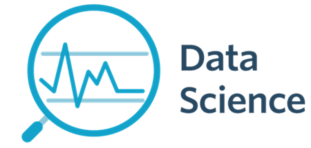

 

  

# André Leocádio
*Data Science Student*

Este Portfólio tem como objetivo:

- Demonstrar minhas habilidades adquiridas na área da Ciências de Dados, buscando resolver problemas e encontrar insights nos dados de um modo prático. Exercer tarefas de coletas de dados estruturados, não-estruturados e realizar predições com utilização de dados supervisionados e não-supervisionados. 
- Mostrar como é feita a análise exploratória e o pré-processamento dos dados por meio da mineração, manipulação e preparação das bases, com o auxílio da análise estatística descritiva. Por meio das bibliotecas em Python com esse escopo.
- Coleta de Dados utilizando APIs e Web-Scrapping, facilitando assim a sua utilização das mais diversas features em modelos de Machine Learning. E a manipulação de bases de dados por meio da linguagem SQL.
- Utilizar algoritmos de Machine Learning com a utilização das principais bibliotecas em Python: Scikit-Learning e Keras. E mostrar técnicas utilizadas para a realização de Tunning de modelos e Deploy do mesmo com a utilização de web-apps.

**Background in:** Python | SQL | Machine Learning | Econometria | Power BI.

**Links:**
* [LinkedIn](https://www.linkedin.com/in/andr%C3%A9-leoc%C3%A1dio-80824115b/)
* [Lattes](http://lattes.cnpq.br/1814826624249012)

## Projetos:
Nos links abaixo contém alguns dos meus projetos em uma ordem empírica de utilização de habilidades, todos realizados com a linguagem de programação Python.

* Análise Exploratória e Pré-processamento:

  * Pré-Processamento de dados: https://bit.ly/2U7Yz5x
  * Exploratory Data Analisys (EDA): https://bit.ly/36YXRwG
  * Amostragem e Estatítica descritiva: https://bit.ly/31HqOfC 
  * Análise exploratória em meu Spotify: https://bit.ly/2Axz46T
  * Processamento de imagens utilizando o Python: https://bit.ly/2YT4UEh

* Machine Learning:

  * Classificação de rendimento com os dados do Censo: https://bit.ly/2GfcPFz
  * Webapp de previsão de valores de imóveis: https://bit.ly/2ELgdYa
  * Detecção de Câncer de Mama: https://bit.ly/3eLSALv
  * Prevendo ações da Petrobras PETR4: https://bit.ly/2BnrmfM
  * Utilizando a técnica de Stacking: https://bit.ly/2Y1sayR
  * Utilizando Pipelines para automatização: https://bit.ly/2UaIjAS
  * Validando modelos por meio da curva AUC: https://bit.ly/304BBQz
  * Fazendo deploy de um modelo de machine learning: https://bit.ly/3dwrpEf
  * Utilizando a técnica de Reg Linear Gradiente descendente: https://bit.ly/3hLZKBx

* Séries Temporais:

  * Realizando previsões de vendas: https://bit.ly/2Dec91V
  
* Deep Learning e Visão Computacional:
  
  * Reconhecimento facial utilizando a biblioteca OpenCV: https://bit.ly/31JQcBx
  * Reconmhecimento de faces utilizando a biblioteca Facenet: https://bit.ly/3beO87B

* Web Scraping:

  * Coleta de dados demográficos e econômicos no Wikipédia: https://bit.ly/34QVWLA
  * Web scraping e limpeza de dados, de carros a venda na OLX no estado do Paraná: https://bit.ly/3bcltA0

* API:

  * Utilizando o API da Alpha Vantage e Yahoo Finance para análise de ações: https://bit.ly/2EGrSre

* Visualização de Dados:

  * Materiais para visualização em Python: https://bit.ly/2Xu8NiD
  * Plotly: https://bit.ly/3dvzJnR
  * Montando um simples Dashboard em Python: https://bit.ly/2U6XsDk

* SQL:

  * Utilizando a biblioteca sqlalchemy, para manipulação de queries SQL: https://bit.ly/3htKE3T 
  * Importando dados para o MySQL, por meio da biblioteca sqlalchemy: https://bit.ly/3bbT90C

